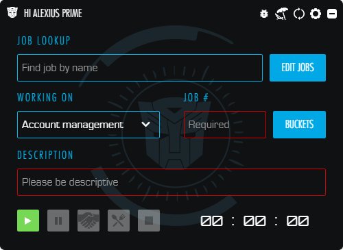
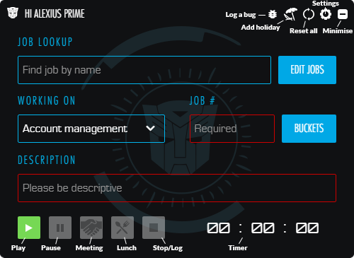
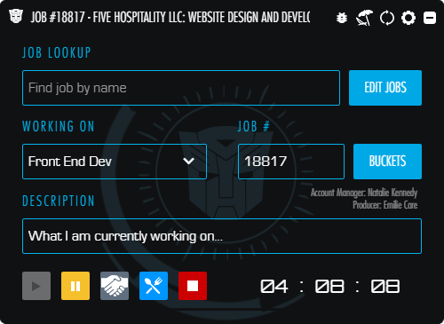
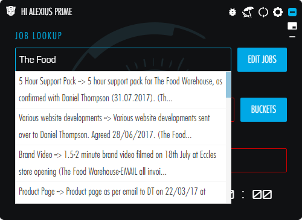

# OptimusTimeRelease

Public releases for OptimusTime v1.1.0

**The Fat Media Time Tracker**

An internal platform app for tracking and logging time to Fatranet. Get the latest version [here](https://github.com/FatMedia/OptimusTimeRelease/releases/latest).

## Installation

Download the [package](https://github.com/FatMedia/OptimusTimeRelease/releases/latest) for your platform and save somewhere then run the executable. For Windows users you will have a shortcut added to your Startup folder so that the app runs when you start your computer.

### Installation Issues

You will need to have at least the Visual Studio Redistributable Tools installed on a Windows machine to run the Time Tracker. If you have installed it and get something like the following:

you will need to head [here](https://www.microsoft.com/en-us/download/details.aspx?id=48145) and download the tools.

---

## How To Use

When the program starts you should see something like the following:

The functionality available should speak for itself but the following is a breakdown of what's available. Please note that *Job Number* and *Description* are **always** required.

The blue bar at the top can be used to drag the window around and the position should be saved in case you need to close the application or your computer restarts. It will also save anything not yet logged until the app is reset manually. There is an offline mode, which will still allow you to log time and save it locally. When a connection to fatranet is found it will automatically log anything outstanding.

In the event of a crash you can reload the application from `Start > Fat Media Ltd` and click `OptimusTime`.

---

### General Functionality

To start, press the 'play' button. You can pause the timer with the 'pause' button and the 'stop' button will stop timing and log any time counted.

---

### Search

If you do not know the Job Number of your current work there is a *Job Lookup* field at the top that allows you to search for jobs by text. It's not great, but it might help. Clicking on an option will populate the *Job Number* field:

---

### Lunch

The 'bell' button allows you to easily pause the timer for the lunch period. Click it then go for lunch and it will automatically start tracking after the lunch time has ended (you can change your lunch duration in setting (the cog button)).

---

### Stop and log time

The 'stop' button will **log your time** to fatranet and **reset the timer**. It will only become available once you have added a *Job Number* and *Description* to the job. Don't forget to select the correct task from the dropdown too!

---

### Send time

The 'send time' button will only be shown if you have unlogged time and have, for some reason, closed and re-opened the program. If you just forgot to log it click the button and it will send any unlogged time to the current job.

---

### Meetings

There is a 'meeting' button next to the 'reset' button that allows you to pause the timer for a meeting and then, optionally, track the accrued time during the meeting to a bucket (or Job Number):

---

### Reset

The 'reset' button (on the right) will just reset everything without logging any currently tracked time. You will get a prompt in case this was clicked accidentally, but once clicked this action cannot be undone.

---

### Mini mode

To enable 'mini mode' click the arrow in the bottom right (and again to return to 'full mode'):

---

### Settings

There are a couple of settings currently available including the ability to change the duration of your lunch as not everyone has 1 hour, and change your start and finish time (for reminders). If you use the lunch function make sure to set this to your lunch break time (default is 1 hour).

## Copyright and License

Copyright [Fat Media](http://www.fatmedia.co.uk) GmbH under the [MIT license](LICENSE.md).
