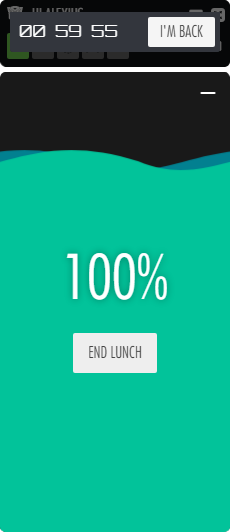

[](https://travis-ci.com/FatMedia/OptimusTime) [](https://ci.appveyor.com/project/hodp/optimustime)

# OptimusTime

**The Fat Media Time Tracker**

An internal platform app for tracking and logging time to Fatranet. Get the latest version [here](https://github.com/FatMedia/OptimusTime/releases/latest).


## Installation

Download the [package](https://github.com/FatMedia/OptimusTime/releases/latest) for your platform and save somewhere then run the executable. For Windows users you will have a shortcut added to your Startup folder so that the app runs when you start your computer.


### Installation Issues

You will need to have at least the Visual Studio Redistributable Tools installed on a Windows machine to run the Time Tracker. If you haven't installed it and get something like the following:


you will need to head [here](https://www.microsoft.com/en-us/download/details.aspx?id=48145) and download the tools.

---

## How To Use

When the program starts you should see something like the following:


The functionality available should speak for itself but the following is a breakdown of what's available. Please note that *Job #* and *Description* are **always** required.


The top section of the app can be used to drag the window around and the position is saved in case you need to close the application or your computer restarts. It will also save anything not yet logged until the app is reset manually. There is an offline mode, which will still allow you to log time and save it locally. When a connection to fatranet is found it will automatically log anything outstanding.

In the event of a crash you can reload the application from `Start > Fat Media Ltd` and click `OptimusTime`. Crashes are reported to Slack with a screenshot (on PC) of the app at the time of the crash.

---

### General Functionality

To start, press the 'play' button. You can pause the timer with the 'pause' button and the 'stop' button will stop timing and log any time counted. You cannot log time until you have filled out the *Job #* and *Description* fields.


---

### Search

If you do not know the Job Number of your current work there is a *Job Lookup* field at the top that allows you to search for jobs by text. It's not great, but it might help. Clicking on an option will populate the *Job Number* field:


---

### Lunch

The 'knife & fork' button allows you to easily pause the timer for the lunch period. Click it then go for lunch and it will ask you to continue tracking after the lunch time has ended (you can change your lunch duration in setting (the cog button)). You can minimise the lunch countdown animation if you like by clicking the line in the top right of the lunch window.



---

### Stop and log time

The 'stop' button will **log your time** to fatranet and **reset the timer**. It will only become available once you have added a *Job #* and *Description* to the job. Don't forget to select the correct task from the *Working On* dropdown too!

If you close and re-open the app the stop button will be active to allow you to log any previous time you had accrued. After time is logged the description field is reset and the timer resets to 00:00:00.

---

### Meetings

There is a 'meeting' button next to the 'lunch' button that allows you to pause the timer for a meeting and then, optionally, track the accrued time during the meeting to a bucket (or Job #):


---

### Reset

The 'reset' button (in the header on the right) will just reset everything without logging any currently tracked time. You will get a prompt in case this was clicked accidentally, but once clicked this action cannot be undone.

---

### Mini mode

To enable 'mini mode' click the minimise icon in the top right (and again to return to 'full mode'). When you hover over this icon you are also given some other options that allow you to minimise the app toe the taskbar, or minimise to the system tray.


---

### Settings

There are a couple of settings available to you, including the ability to change the duration of your lunch as not everyone has 1 hour, and change your start and finish time (for reminders). If you use the lunch function make sure to set this to your lunch break time (default is 1 hour). You can also change the window opacity by dragging the slider at the bottom.

If you are working on flex work you should set the rounding in Settings to 15 minutes as all flex work is rounded up to the nearest 15. The app will handle this if the rounding is set to 15.

Break reminders allow you to set a time (in minutes) to show a random reminder that you should probably take a short break, or get a drink. More will be added soon!


---

#### Settings buttons

There are a number of other buttons in settings. From left to right they:

* Reset your config (all settings and data stored in the app).
* Show the changelog. Each update has a changelog to let you know what has changed.
* Refresh - think of it as a page reload. If something goes wonky it's the first thing to try.
* Check for updates: app updates are automatic so you don't need to use this. However, clicking it will do a fresh check for the latest update.
* Save & close must be clicked to save the settings.


## Developers


**Documentation that I've found useful:**
* http://electron.atom.io/docs/api/
* https://github.com/electron/electron
* https://github.com/sindresorhus/awesome-electron
* https://github.com/electron-userland/electron-packager
* https://github.com/electron/electron-api-demos
* https://github.com/unindented/electron-installer-windows (works better than the electron one (electron-winstaller))


### Installation

Open Node.js CMD prompt and CD to the directory of the project and run:

```
npm i
```

#### And then run it

```
npm start
```


#### Dev mode

When developing the Chrome Web Developer Tools can be opened with the command Ctrl + Shift + i. However, you can add some extra debugging to the process by running:

```
npm run dev
```


### Building/Releasing

**Please note: the following can only be run on the device you wish to create the application for due to the restrictions on device-dependent `node_modules`.**


#### Build installers

To build the installers we use `electron-packager` and `electron-installer-windows` to handle the leg work. There are a couple of npm scripts setup to handle this in `package.json`. For the basic Windows build and installer run:

```
npm run build
```
*Note: sudo may be required on OSX*


#### Releasing your build

Once everything has been tested and is working you need to commit your changes to GitHub, update the release.js file with the latest changelog and then run the release to publish the latest files. This can be done with:

```
npm run release
```


## Versioning

OptimusTime is maintained by using the [Semantic Versioning Specification (SemVer)](http://semver.org).


## Copyright and License

Copyright [Fat Media Ltd](http://www.fatmedia.co.uk) under the [MIT license](LICENSE.md).
